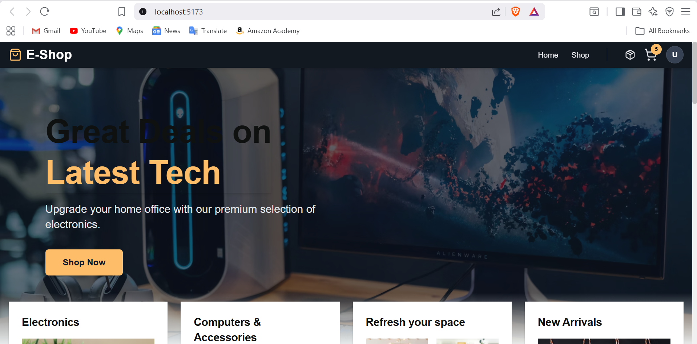
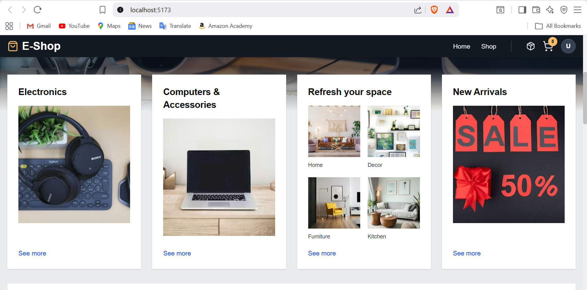
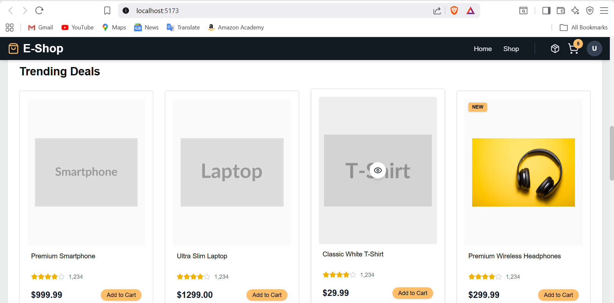
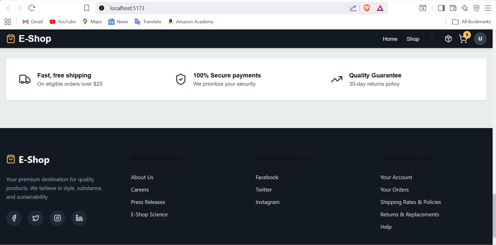
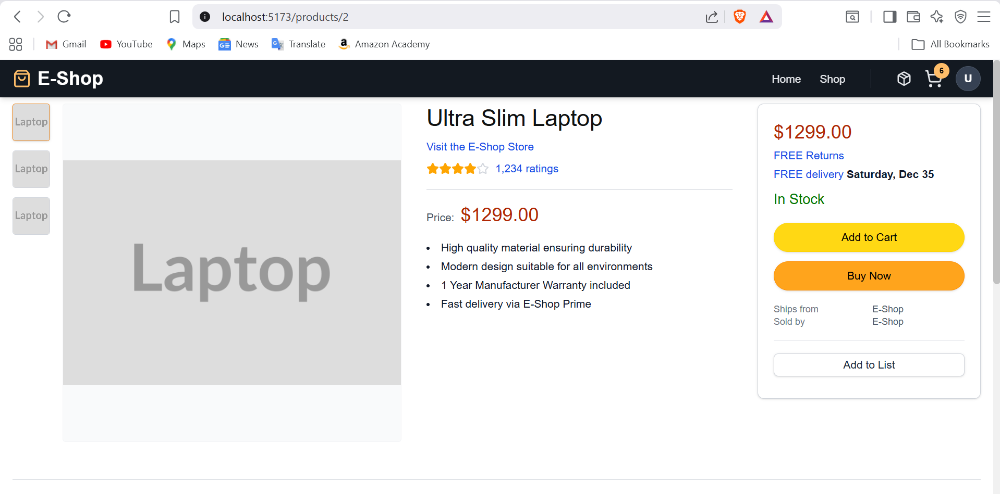
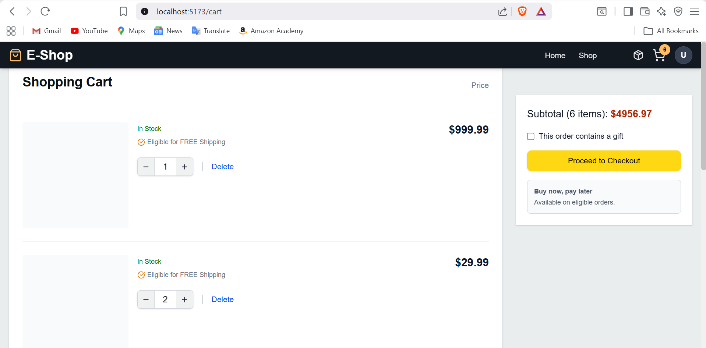
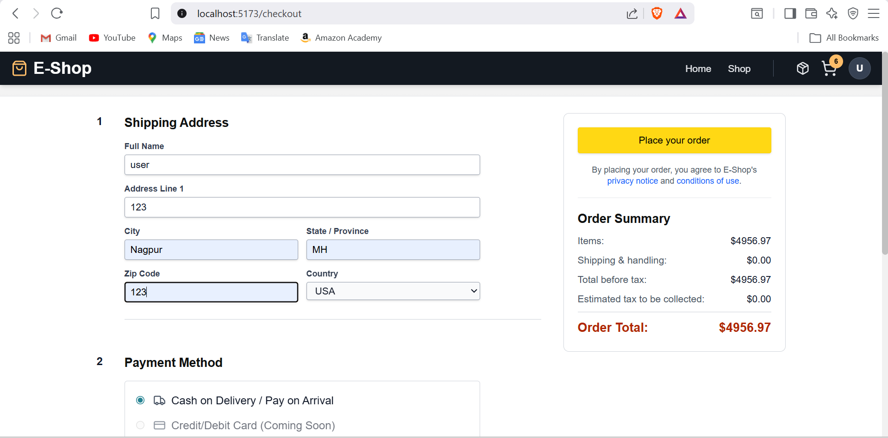
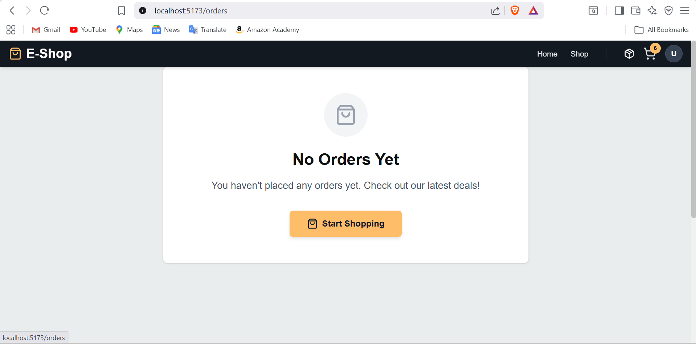
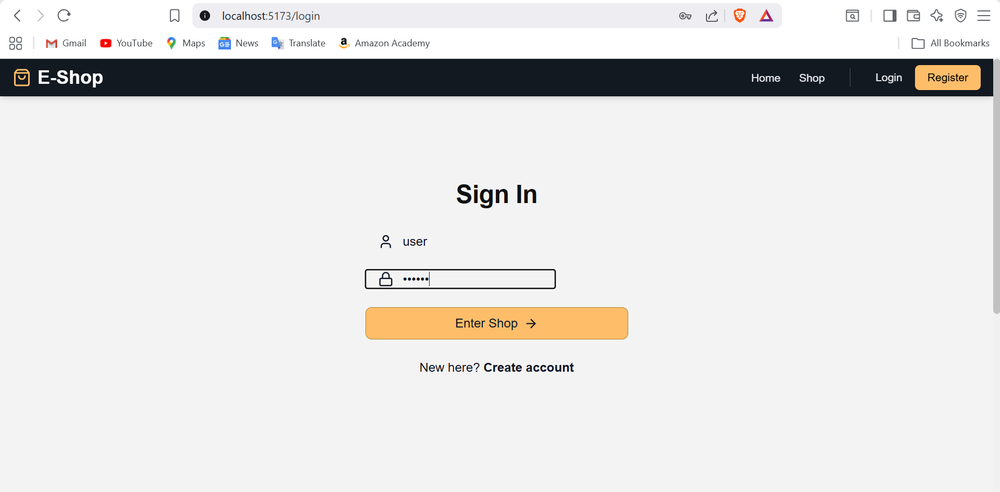
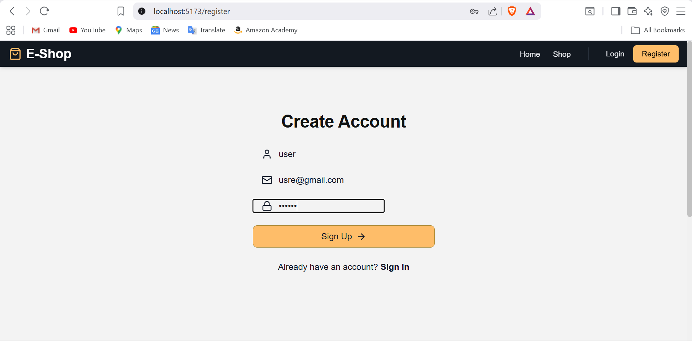

# E-Commerce Full-Stack Application

A comprehensive e-commerce platform featuring a Spring Boot backend and a React/Vite frontend.

## 📸 Screenshots
### Home & Navigation
| Home (Hero) | Home (Features) | Home (Products) | Footer |
| :---: | :---: | :---: | :---: |
|  |  |  |  |

### Shopping Experience
| Product Detail | Shopping Cart | Checkout | Order Confirmation |
| :---: | :---: | :---: | :---: |
|  |  |  |  |

### User Authentication
| Sign In | Sign Up |
| :---: | :---: |
|  |  |

## 🚀 Features
- **User Authentication**: Secure login and registration.
- **Product Management**: Browse, search, and view product details.
- **Shopping Cart**: Add/remove products and manage quantities.
- **Order System**: Checkout process and order history tracking.
- **Responsive UI**: Optimized for both desktop and mobile devices.

## 🛠️ Technology Stack

### Backend
- **Framework**: Spring Boot 3.x
- **Language**: Java 17+
- **Database**: MySQL
- **ORM**: Spring Data JPA / Hibernate
- **Build Tool**: Maven

### Frontend
- **Library**: React 19
- **Build Tool**: Vite
- **Styling**: Tailwind CSS
- **Animations**: Framer Motion
- **Icons**: Lucide React
- **Routing**: React Router DOM

## 📦 Getting Started

### Prerequisites
- **Java JDK 17** or higher
- **Node.js** (v18+) and **npm**
- **MySQL Server**

### 1. Database Setup
1. Create a MySQL database named `ecommerce_db`.
2. Update the credentials in `e-commerce-backend/src/main/resources/application.properties`.

### 2. Run the Backend
```bash
cd e-commerce-backend
./mvnw spring-boot:run
```
The backend will start at `http://localhost:8080`.

### 3. Run the Frontend
```bash
cd e-commerce-frontend
npm install
npm run dev
```
The frontend will be available at `http://localhost:5173`.

## 📂 Project Structure
- `e-commerce-backend/`: Spring Boot source code and configurations.
- `e-commerce-frontend/`: React frontend source code, components, and assets.
- `ecommerce_db.sql`: Database schema export (if applicable).

---
*Created by [Prashik205](https://github.com/Prashik205)*
